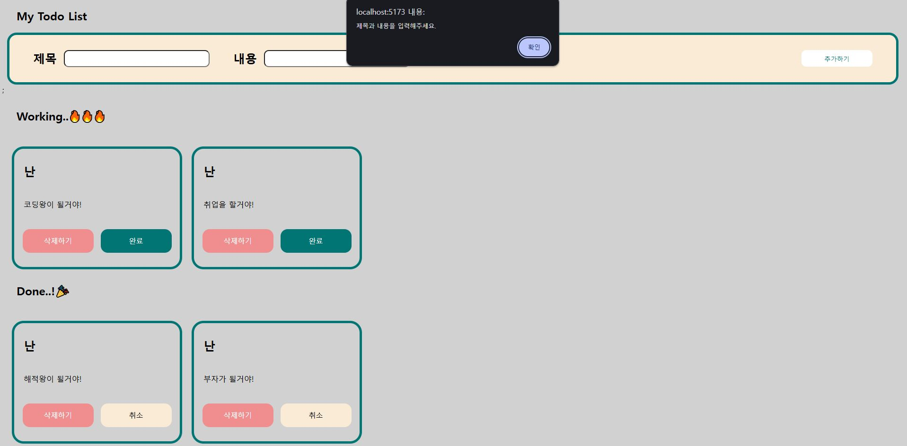

<h2>📒React 나만의 할 일 목록📒</h2>
할 일 목록을 관리하는 프로그램 입니다.


---


## 💡프로젝트 설명
할 일을 화면에 표시해주어 선택 삭제 및 완료된 목록까지 관리할 수 있는 기능을 제공하며, CRUD 방식을 활용해 간단하고 효율적으로 조작하실 수 있습니다.


---

## 🖼️스크린샷



---


## 🌟프로젝트 구조 및 기능

```plaintext
my-todo-list/
├── LICENSE
├── README.md
├── public/
├── src/
│   ├── assets/
│   │    ├── capture.jpg
│   ├── components/
│   │    ├── TodoForm.jsx
│   │    ├── TodoList.jsx
│   │    └── TodoItem.jsx
│   ├── styles/
│   │    └── main.css
│   ├── App.css
│   ├── App.jsx
│   ├── index.css
│   ├── main.jsx

```


---
## ⚙️설치 방법

#### ▶️프로젝트 클론 : https://github.com/noodlewd/my-todo-list.git
                                                                                    
#### 🔽의존성 설치 : yarn install
                                          
#### ◀️개발 서버 시작 : yarn dev

## ✏️사용 방법 : 브라우저에서 로컬환경으로 실행하여 프로그램을 이용하실 수 있습니다.


---


## 🛠️기술 스택
- **프론트엔드**: React, Vite, CSS
- **개발 도구**: Visual Studio Code, Git


---


## 👨🏻‍🏫기능설명

### 1️⃣. 제목 및 내용 추가 기능
 - 사용자가 작성할 제목과 내용을 작성 후 우측 추가버튼을 이용하여 박스안에 데이터가 들어온 것을 확인할 수 있습니다.

### 2️⃣. 수정(관리) 기능
 - 처음 작성하여 추가를 할 시 Work상태로 지정되며, 이후 완료 버튼을 클릭 시 Done상태로 이동하며 유지 관리할 수 있습니다.

### 3️⃣. 삭제 기능
 - 작성한 정보가 잘못된 경우 삭제 버튼을 이용하여 데이터를 처리할 수 있습니다.


---

## 👨‍💻개발 인원
- 김동우(프론트엔드)


---


## ✅추가 계획
- 제목 및 내용 수정 기능
- 즐겨찾기 기능
